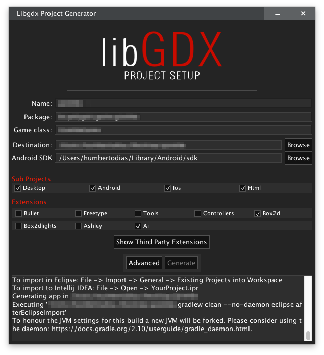

# Mario Bros with libGDX

Platform game like Super Mario Bros 1 using libGDX Library

## 🎮 Play Online

**[Play the Web Version Here](https://humbertodias.github.io/game-mario-bros-libgdx/)**

The game is automatically built and deployed to GitHub Pages on every commit to the main branch.

## Prerequires

1. Git 2.6+
2. Gradle 2.11+
3. Java 11+ (Java 11 recommended for building the web version)


## How to Play

Clone

```
git clone https://github.com/humbertodias/game-mario-bros-libgdx.git
```

Inside the folder

```
cd game-mario-bros-libgdx/src
```

Run

```
gradle desktop:run
```

## Building the Web Version

To build the HTML/web version locally:

```bash
cd src
./gradlew html:dist
```

The built files will be in `src/html/build/dist/`. You can serve them with any web server.

## Output


## Control


## How it was made
First I had to download the **App Setup**

[https://libgdx.badlogicgames.com/download.html](https://libgdx.badlogicgames.com/download.html)

Then generate the project



After that, watch the **Brent Aureli** Youtube class

[LibGDX - Super Mario Bros](https://www.youtube.com/watch?v=a8MPxzkwBwo&list=PLZm85UZQLd2SXQzsF-a0-pPF6IWDDdrXt)

### Needed **Tools**

1. Tiled Map Editor
	
	[http://www.mapeditor.org](http://www.mapeditor.org)

2. Android Studio

	[http://developer.android.com/intl/pt-br/sdk/index.html](http://developer.android.com/intl/pt-br/sdk/index.html)


3. Sprites of **Super Mario Bros 1**

	[http://www.spriters-resource.com](http://www.spriters-resource.com/nes/supermariobros/)

## References

[libGDX HOME](https://libgdx.badlogicgames.com/)

[libGDX API](https://libgdx.badlogicgames.com/nightlies/docs/api)

[libGDX with Maven](https://github.com/libgdx/libgdx/wiki/Maven-integration)

[libGDX Project Setup](https://github.com/libgdx/libgdx/wiki/Project-Setup-Gradle)
