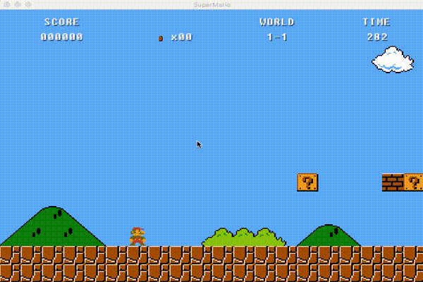
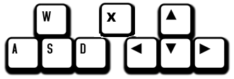

[](https://github.com/humbertodias/mario-bros-libgdx/actions/workflows/desktop-build.yml)
[](https://github.com/humbertodias/mario-bros-libgdx/actions/workflows/deploy-gh-pages.yml)

# Mario Bros (libGDX)

A platform game inspired by **Super Mario Bros (NES)**, built using the **libGDX** framework.


## 🎮 Play Online

👉 **[Play the Web Version](https://humbertodias.github.io/mario-bros-libgdx/)**

The web version is automatically built and deployed to **GitHub Pages** on every commit to the `main` branch.


## ✅ Prerequisites

Make sure you have the following installed:

* **Git** 2.6+
* **Gradle** 2.11+
* **Java** 11+


## ▶️ How to Play

### Download Pre-built Release

Download the latest desktop JAR from the
[Releases](https://github.com/humbertodias/mario-bros-libgdx/releases) page and run:

```bash
java -jar desktop-1.0.jar
```


### Build and Run from Source

Clone the repository:

```bash
git clone https://github.com/humbertodias/mario-bros-libgdx.git
```

Navigate to the project directory:

```bash
cd mario-bros-libgdx/src
```

Run the desktop version:

```bash
gradle desktop:run
```


## 🌐 Building the Web Version

To build the HTML/Web version locally:

```bash
cd src
./gradlew html:dist
```

The generated files will be located at:

```
src/html/build/dist/
```

You can serve them using any static web server.


## 🖥️ Building the Desktop Distribution

```bash
gradle desktop:dist
```

The generated JAR will be available at:

```
desktop/build/libs/desktop-1.0.jar
```


## 📸 Gameplay Preview




## 🔄 CI/CD

This project uses **GitHub Actions** for automation:

* **Continuous Integration**
  On every push to `main`/`master` or pull request, the desktop JAR is built and uploaded as an artifact (available for 30 days).

* **Releases**
  When a tag is pushed (e.g. `v1.0.0`), a GitHub Release is automatically created with the desktop JAR attached.

### Creating a New Release

```bash
git tag -a v1.0.0 -m "Release version 1.0.0"
git push origin v1.0.0
```


## 🎮 Controls

**Movement (WASD / Arrow Keys)**


**Jump (Spacebar)**


## 🛠️ How It Was Made

1. Download the **libGDX Project Setup Tool**
   [https://libgdx.com/wiki/start/project-generation](https://libgdx.com/wiki/start/project-generation)

2. Generate the project using the setup tool.

3. Follow the **Brent Aureli** YouTube tutorial series:
   [LibGDX – Super Mario Bros](https://www.youtube.com/watch?v=a8MPxzkwBwo&list=PLZm85UZQLd2SXQzsF-a0-pPF6IWDDdrXt)


## 🧰 Tools Used

1. **Tiled Map Editor**
   [http://www.mapeditor.org](http://www.mapeditor.org)

2. **Android Studio**
   [http://developer.android.com/intl/pt-br/sdk/index.html](http://developer.android.com/intl/pt-br/sdk/index.html)

3. **Super Mario Bros (NES) Sprites**
   [http://www.spriters-resource.com/nes/supermariobros/](http://www.spriters-resource.com/nes/supermariobros/)


## 📚 References

* [libGDX Home](https://libgdx.badlogicgames.com/)
* [libGDX API](https://libgdx.badlogicgames.com/nightlies/docs/api)
* [libGDX with Maven](https://github.com/libgdx/libgdx/wiki/Maven-integration)
* [libGDX Project Setup (Gradle)](https://github.com/libgdx/libgdx/wiki/Project-Setup-Gradle)
